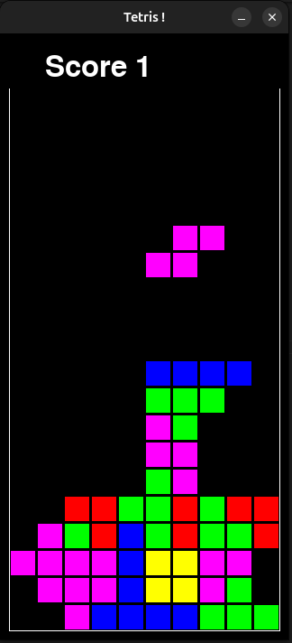
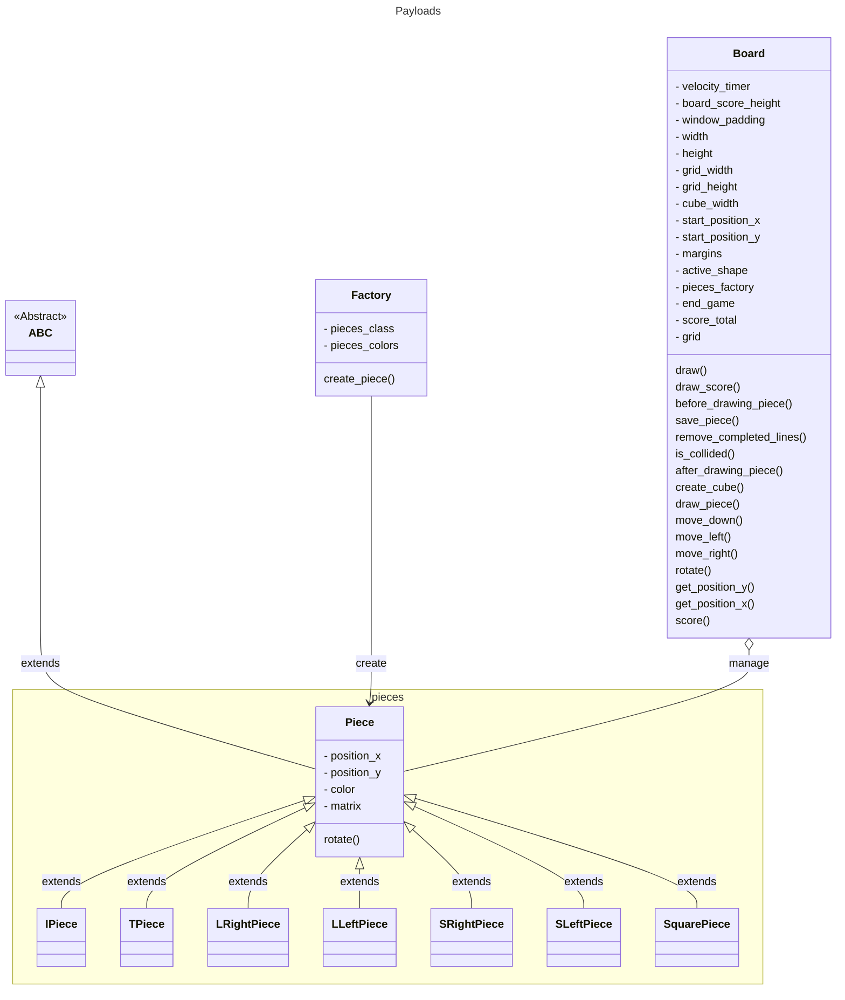

# Tetris

This is a tetris like (test of PyGame python library: https://www.pygame.org)

# How to start

Create virtual env, install requirements and start the game: 

```
python3 -m venv .venv
source .venv/bin/activate
pip install -r requirements.txt 
python3 main.py
deactivate
```

# Screenshot



# High Level Design

